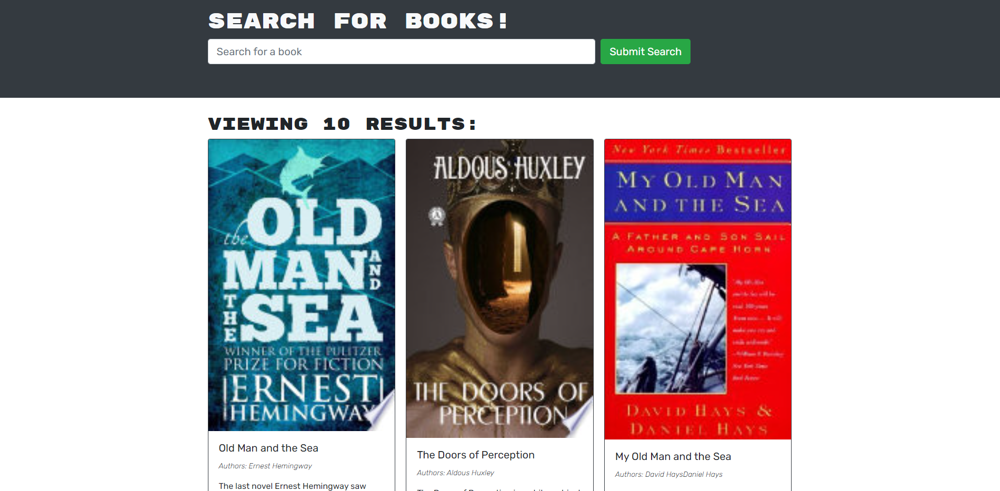
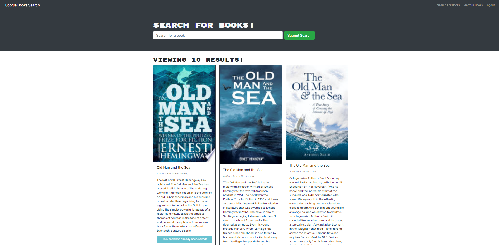
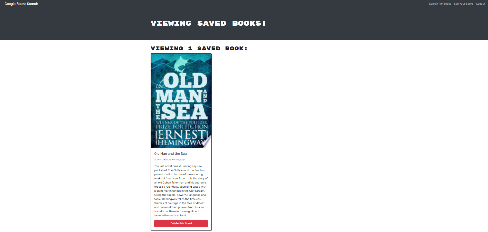

# Book-Search-Engine

## Description

This application is a full functioning Google Books API search engine built with GraphQL API built with Apollo Server.The app was built using the MERN stack with a React front end, MongoDB database, and Node.js/Express.js server and API. It's already set up to allow users to save book searches to the back end.

## Technologies

  - JavaScript
  - HTML/CSS
  - MERN Stack

## Screenshots

## Deployed Link
https://lit-coast-09850.herokuapp.com/

## Github Link
https://github.com/houchenghao/Book-Search-Engine
